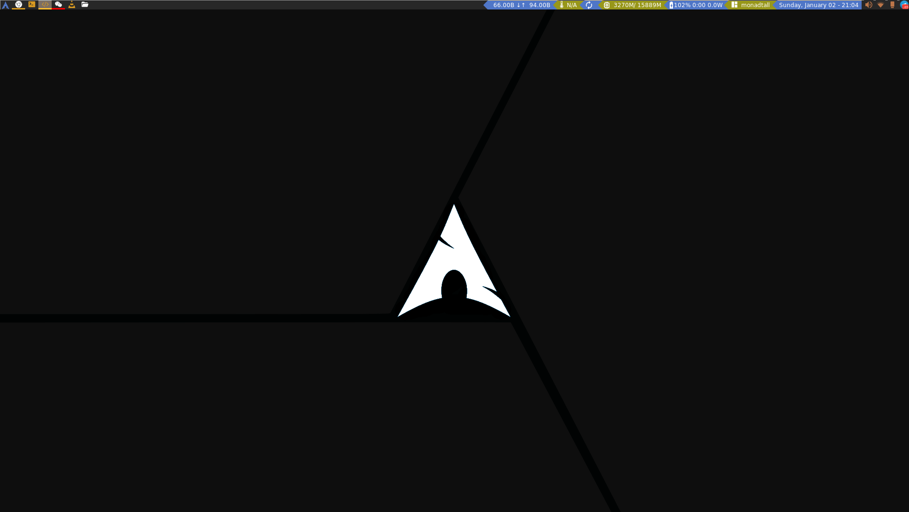
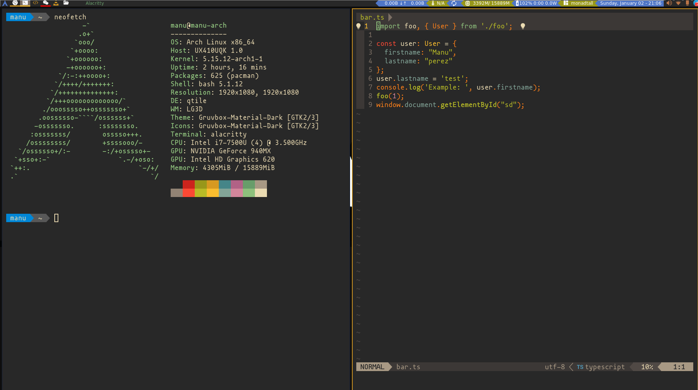

# Dotfiles & Configs

***Quick Links***
- *Window manager configs*
  - [Qtile](https://github.com/manu2manu/.config/tree/main/qtile)
  - [Alacritty](https://github.com/manu2manu/.config/tree/main/alacritty)
  - [Nvim](https://github.com/manu2manu/.config/tree/main/nvim)
  - [Rofi](https://github.com/manu2manu/.config/tree/main/rofi)
